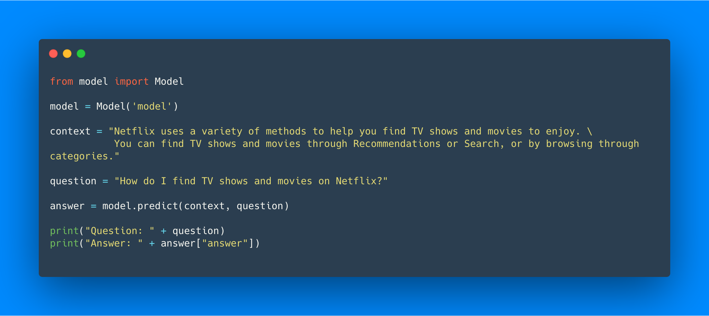
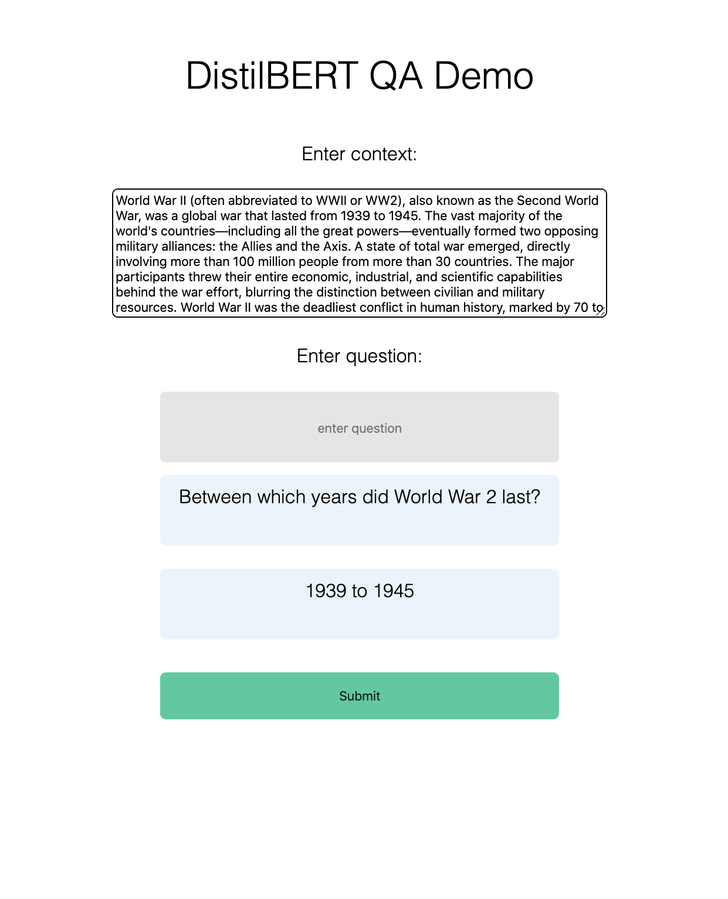

# DistilBERT-SQuAD

# What is DistilBERT?

DistilBERT is a small, fast, cheap and light Transformer model based on Bert architecture. It has 40% less parameters than bert-base-uncased, runs 60% faster while preserving 97% of BERT's performance as measured on the GLUE language understanding benchmark. DistilBERT is trained using knowledge distillation, a technique to compress a large model called the teacher into a smaller model called the student. By distillating Bert, we obtain a smaller Transformer model that bears a lot of similarities with the original BERT model while being lighter, smaller and faster to run. DistilBERT is thus an interesting option to put large-scaled trained Transformer model into production.

[Transformers - Hugging Face repository](https://github.com/huggingface/transformers)


# The Stanford Question Answering Dataset (SQuAD)

Stanford Question Answering Dataset (SQuAD) is a reading comprehension dataset, consisting of questions posed by crowdworkers on a set of Wikipedia articles, where the answer to every question is a segment of text, or span, from the corresponding reading passage, or the question might be unanswerable.

https://rajpurkar.github.io/SQuAD-explorer/

# Installation

If you are testing this on your own machine I would recommend you do the setup in a virtual environment, as not to affect the rest of your files.

In Python3 you can set up a virtual environment with

```bash
python3 -m venv /path/to/new/virtual/environment
```

Or by installing virtualenv with pip by doing
```bash
pip3 install virtualenv
```
Then creating the environment with
```bash
virtualenv venv
```
and finally activating it with
```bash
source venv/bin/activate
```

You must have Python3

Install the requirements with:
```bash
pip3 install -r requirements.txt
```

### SQuAD Fine-tuned model

The SQuAD fine-tuned model is available [here](https://drive.google.com/open?id=1_hLv-jCSODObrZ3cE_vYKN0vou-7d9K4). Download the model by following the google drive [link](https://drive.google.com/open?id=1_hLv-jCSODObrZ3cE_vYKN0vou-7d9K4) place the downloaded model in ```model```.

alternatively inside the model.py file you can specify the type of model you wish to use, the one I have provided, or a Hugging Face fine-tuned SQuAD model.
```python
distilbert-base-uncased-distilled-squad
```

You can do this with

```python
model = DistilBertForQuestionAnswering.from_pretrained('distilbert-base-uncased-distilled-squad', config=config)
```

# Making predictions



You can also make predictions by using the provided demo which is deployed with Flask to handle the interactions with the UI.



# How to train (Distil)BERT

The data for SQuAD can be downloaded with the following links and should be saved in a $SQUAD_DIR directory.

- [train-v1.1.json](https://rajpurkar.github.io/SQuAD-explorer/dataset/train-v1.1.json)

- [dev-v1.1.json](https://rajpurkar.github.io/SQuAD-explorer/dataset/dev-v1.1.json)

- [evaluate-v1.1.py](https://github.com/allenai/bi-att-flow/blob/master/squad/evaluate-v1.1.py)

Training on one Tesla V100 16GB GPU, each epoch took around 9 minutes to complete, in comparison training on a single Quadro M4000 the time for each epoch took over 2 hours, so don't be alarmed if your training isn't lightning fast.

```bash
export SQUAD_DIR=/path/to/SQUAD

python run_squad.py \
  --model_type distilbert \
  --model_name_or_path distilbert-base-uncased \
  --do_train \
  --do_eval \
  --do_lower_case \
  --train_file $SQUAD_DIR/train-v1.1.json \
  --predict_file $SQUAD_DIR/dev-v1.1.json \
  --per_gpu_train_batch_size 12 \
  --learning_rate 3e-5 \
  --num_train_epochs 2.0 \
  --max_seq_length 384 \
  --doc_stride 128 \
  --output_dir /tmp/debug_squad/
  ```

# References

- <https://github.com/huggingface/transformers>
- <https://medium.com/huggingface/distilbert-8cf3380435b5>
- <https://arxiv.org/pdf/1910.01108.pdf>
